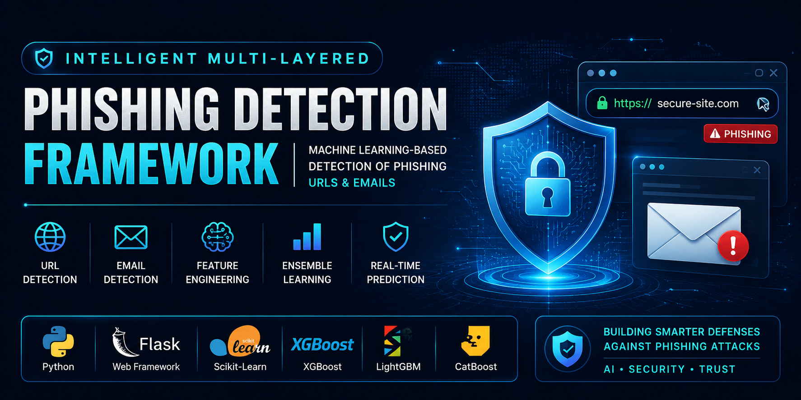
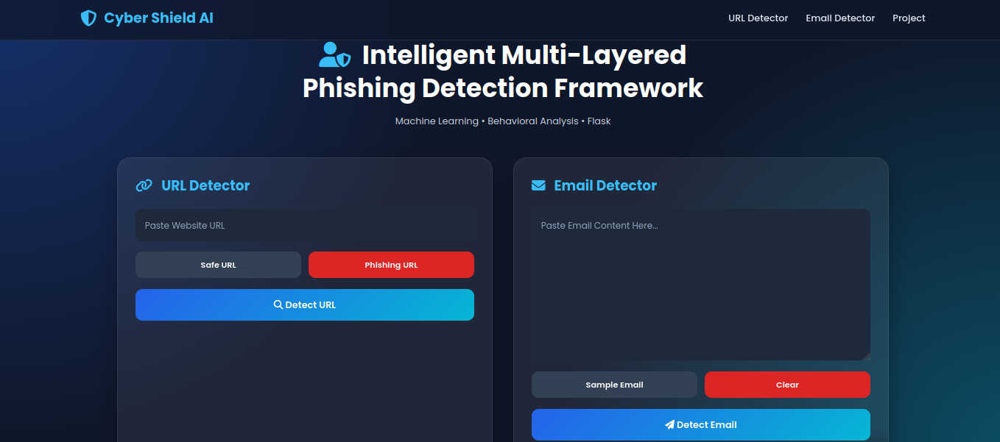
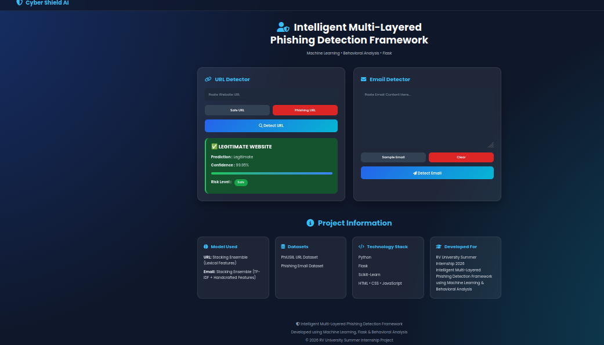
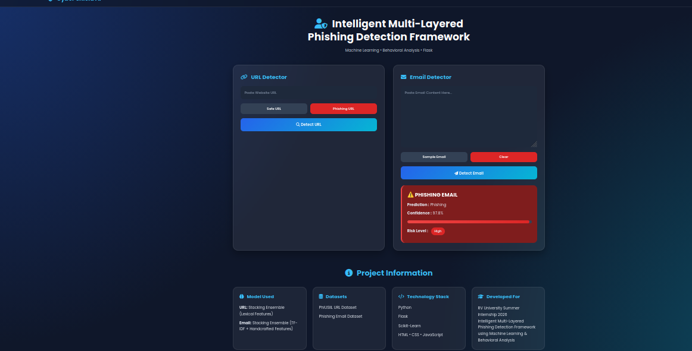
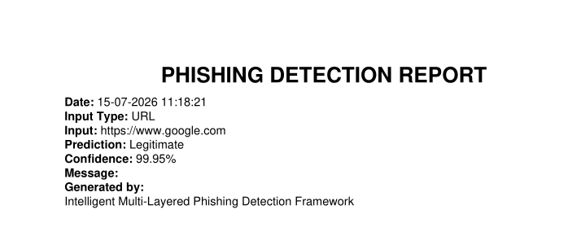

<p align="center">
  
</p>

<h1 align="center">🛡️ Intelligent Multi-Layered Phishing Detection Framework</h1>

<p align="center">
A Machine Learning-powered web application for detecting phishing URLs and phishing emails using advanced feature engineering, ensemble learning, and Flask deployment.
</p>

<p align="center">


</p>

---

# 📑 Table of Contents

- [Overview](#-overview)
- [Project Highlights](#-project-highlights)
- [Objectives](#-objectives)
- [Key Features](#-key-features)
- [Technology Stack](#-technology-stack)
- [Why This Project](#-why-this-project)
- [System Architecture](#-system-architecture)
- [Project Workflow](#-project-workflow)
- [Project Structure](#-project-structure)
- [Dataset](#-dataset)
- [Machine Learning Pipeline](#-machine-learning-pipeline)
- [Design Goals](#-design-goals)
- [Machine Learning Models](#-machine-learning-models)
- [Installation](#-installation)
- [Application Preview](#-application-preview)
- [Results](#-results)
- [Future Enhancements](#-future-enhancements)
- [Project Status](#-project-status)
- [Contributors](#-contributors)
- [Acknowledgements](#-acknowledgements)

---

# 📖 Overview

Phishing attacks remain one of the most common cybersecurity threats, targeting individuals and organizations through fraudulent websites and deceptive emails. Traditional blacklist-based approaches often fail to identify newly created phishing attacks because they rely on previously reported malicious sources.

The **Intelligent Multi-Layered Phishing Detection Framework** addresses this challenge by leveraging **Machine Learning**, **feature engineering**, and **ensemble learning** to detect phishing attempts in real time.

The framework provides two independent detection pipelines:

- 🌐 URL Phishing Detection
- 📧 Email Phishing Detection

The trained machine learning models are integrated into a Flask-based web application that delivers instant predictions, confidence scores, risk classification, and downloadable PDF reports through a simple and user-friendly interface.

---

# 📊 Project Highlights

- 🌐 Dual Detection Framework (URLs & Emails)
- 🤖 Ensemble Learning Models
- 📄 PDF Report Generation
- 🖥️ Flask Web Application
- 📈 Multiple ML Algorithms Compared
- 🔒 Cybersecurity-focused Design
- ⚡ Real-Time Prediction

---

# 🎯 Objectives

The primary objectives of this project are:

- Detect phishing URLs with high accuracy.
- Detect phishing emails using content analysis.
- Compare multiple machine learning algorithms.
- Deploy the best-performing models using Flask.
- Provide real-time predictions with confidence scores.
- Generate downloadable PDF reports.
- Build an intuitive interface for end users.

---

# ✨ Key Features

| Feature | Description |
|----------|-------------|
| 🌐 URL Detection | Detects malicious URLs using lexical feature engineering |
| 📧 Email Detection | Detects phishing emails using TF-IDF and handcrafted features |
| 🤖 Ensemble Learning | Uses stacking ensemble models for prediction |
| 📊 Confidence Score | Displays prediction confidence |
| 🚨 Risk Classification | Categorizes predictions into risk levels |
| 📄 PDF Report | Generates downloadable prediction reports |
| 🖥️ Responsive Interface | Flask-based responsive web application |
| ⚡ Real-Time Prediction | Provides instant analysis results |
| 🛡️ Input Validation | Handles invalid inputs and improves reliability |

---

# 🛠️ Technology Stack

## Programming Language

- 🐍 Python

## Backend

- 🌐 Flask

## Machine Learning

- 📊 Scikit-learn
- ⚡ XGBoost
- 🌿 LightGBM
- 🟨 CatBoost

## Data Processing

- 📈 Pandas
- 🔢 NumPy
- 📉 SciPy

## Feature Engineering

### URL Detection

- URL Length
- Domain Length
- Number of Digits
- Number of Dots
- Number of Hyphens
- Number of Special Characters
- Entropy
- Subdomain Count
- Suspicious Keywords

### Email Detection

- TF-IDF Vectorization
- Text Cleaning
- Handcrafted Email Features

## Frontend

- HTML5
- CSS3
- JavaScript
- Bootstrap
- Font Awesome

## Report Generation

- ReportLab

---

# 🚀 Why This Project?

Unlike conventional phishing detection systems that depend primarily on blacklists, this framework uses machine learning to analyze patterns within URLs and email content, enabling the detection of previously unseen phishing attempts.

The project combines:

- Machine Learning
- Feature Engineering
- Ensemble Learning
- Flask Deployment
- Real-Time Prediction
- PDF Report Generation

into a single end-to-end cybersecurity application suitable for academic research and practical demonstrations.

---

# 🏗️ System Architecture

```text
                    User Input
                         │
          ┌──────────────┴──────────────┐
          │                             │
      URL Detection                Email Detection
          │                             │
          ▼                             ▼
  Feature Engineering          Text Preprocessing
          │                             │
          ▼                             ▼
 Lexical Feature Extraction      TF-IDF Vectorization
          │                             │
          ▼                             ▼
   Trained ML Model             Trained ML Model
          │                             │
          └──────────────┬──────────────┘
                         ▼
                 Prediction Engine
                         │
          ┌──────────────┼──────────────┐
          ▼              ▼              ▼
     Prediction     Confidence     Risk Level
                         │
                         ▼
                PDF Report Generator
                         │
                         ▼
                 Flask Web Application
```

---

# 🔄 Project Workflow

## Phase 1 – Data Collection

- Collect phishing and legitimate URL datasets.
- Collect phishing and legitimate email datasets.
- Prepare datasets for machine learning.

## Phase 2 – Data Preprocessing

### URL Dataset

- Remove duplicate records
- Handle missing values
- Normalize data

### Email Dataset

- Lowercase conversion
- Remove punctuation
- Remove stop words
- Clean HTML tags
- Tokenization

## Phase 3 – Feature Engineering

### URL Features

- URL Length
- Domain Length
- Number of Digits
- Number of Dots
- Number of Hyphens
- Number of Special Characters
- Entropy
- Suspicious Keywords
- Subdomain Count

### Email Features

- TF-IDF Vectorization
- Text Cleaning
- Handcrafted Features
- Numerical Feature Combination

## Phase 4 – Model Training

The following algorithms were trained and evaluated:

- Random Forest
- XGBoost
- CatBoost
- LightGBM
- Stacking Ensemble

The best-performing models were selected for deployment.

## Phase 5 – Deployment

The trained models are integrated into a Flask web application where users can:

- Analyze URLs
- Analyze Emails
- View prediction confidence
- Download PDF reports

---

# 📂 Project Structure

```text
phishing-detection-framework/
│
├── app.py
├── predictor.py
├── feature_engineering.py
├── model_loader.py
├── requirements.txt
├── README.md
├── Technical_Report.md
│
├── deploy_artifacts/
│   ├── Email_StackingEnsemble.pkl
│   ├── URL_Lexical_StackingEnsemble.pkl
│   ├── email_feature_columns.pkl
│   ├── url_feature_columns.pkl
│   ├── tfidf_vectorizer_clean.pkl
│   └── version_info.json
│
├── models/
│   ├── URL Models
│   ├── Email Models
│   ├── Baseline Models
│   └── Tuned Models
│
├── static/
├── templates/
├── Screenshots/
└── docs/
```

---

# 📊 Dataset

The framework uses separate datasets for URL phishing detection and email phishing detection.

### URL Dataset

Contains phishing and legitimate URLs used for lexical feature extraction and machine learning model training.

### Email Dataset

Contains phishing and legitimate email samples.

The dataset undergoes preprocessing, TF-IDF vectorization, and feature extraction before model training.

---

# 📈 Machine Learning Pipeline

```text
Dataset
    │
    ▼
Preprocessing
    │
    ▼
Feature Engineering
    │
    ▼
Model Training
    │
    ▼
Model Evaluation
    │
    ▼
Best Model Selection
    │
    ▼
Flask Deployment
    │
    ▼
Real-Time Prediction
```

---

# 🎯 Design Goals

The framework was designed with the following objectives:

- High phishing detection accuracy
- Real-time prediction
- Easy deployment
- Modular architecture
- Scalable implementation
- User-friendly interface
- Reliable prediction reporting

---

# 🤖 Machine Learning Models

The framework evaluates multiple supervised machine learning algorithms for phishing detection. Models were trained, compared, and evaluated to identify the best-performing approach for deployment.

## 🌐 URL Phishing Detection Models

| Model | Status | Purpose |
|--------|--------|---------|
| Random Forest | ✅ Trained | Baseline ensemble classifier |
| XGBoost | ✅ Trained | Gradient boosting model |
| LightGBM | ✅ Trained | Efficient gradient boosting |
| CatBoost | ✅ Trained | Gradient boosting with categorical feature support |
| **Stacking Ensemble** | 🚀 Deployed | Final prediction model |

---

## 📧 Email Phishing Detection Models

| Model | Status | Purpose |
|--------|--------|---------|
| Random Forest | ✅ Trained | Baseline classifier |
| XGBoost | ✅ Trained | Gradient boosting classifier |
| LightGBM | ✅ Trained | High-performance boosting |
| CatBoost | ✅ Trained | Advanced boosting algorithm |
| **Stacking Ensemble** | 🚀 Deployed | Final prediction model |

---

# 🎯 Model Selection Strategy

Instead of relying on a single machine learning algorithm, this framework evaluates multiple classifiers for both URL and email phishing detection.

The **Stacking Ensemble** models were selected for deployment because they combine predictions from multiple base learners, providing improved robustness and reliable performance across different phishing scenarios.

---

# ⚙️ Deployment Artifacts

The Flask application loads deployment-ready artifacts stored in the `deploy_artifacts/` directory.

| Artifact | Purpose |
|----------|---------|
| Email_StackingEnsemble.pkl | Email prediction model |
| URL_Lexical_StackingEnsemble.pkl | URL prediction model |
| tfidf_vectorizer_clean.pkl | Email feature extraction |
| email_feature_columns.pkl | Email feature metadata |
| url_feature_columns.pkl | URL feature metadata |
| version_info.json | Model version information |

---

# 🚀 Installation

## Prerequisites

- Python 3.10 or later
- Git
- pip

---

## Clone Repository

```bash
git clone https://github.com/rohit-khokhar/phishing-detection-framework.git

cd phishing-detection-framework
```

---

## Create Virtual Environment

### Windows

```bash
python -m venv venv

venv\Scripts\activate
```

### Linux / macOS

```bash
python3 -m venv venv

source venv/bin/activate
```

---

## Install Dependencies

```bash
pip install -r requirements.txt
```

---

## Run the Application

```bash
python app.py
```

Open your browser and visit:

```
http://127.0.0.1:5000
```

---

# 🖥️ Application Features

| Feature | Description |
|----------|-------------|
| 🌐 URL Detection | Detect phishing URLs in real time |
| 📧 Email Detection | Analyze email content for phishing indicators |
| 📊 Confidence Score | Display prediction confidence |
| 🚨 Risk Classification | Categorize predictions into risk levels |
| 📄 PDF Report | Generate downloadable prediction reports |
| ⚡ Real-Time Prediction | Instant inference using deployed models |
| 🛡️ Input Validation | Validate user inputs before prediction |
| 📱 Responsive Interface | Accessible across desktop and mobile devices |

---

# 📸 Application Preview

## 🏠 Home Page

<p align="center">

</p>

---

## 🌐 URL Detection

<p align="center">

</p>

---

## 📧 Email Detection

<p align="center">

</p>

---

## 📄 Generated PDF Report

<p align="center">

</p>

---

# 📊 Results

The developed framework successfully integrates machine learning models into a Flask-based web application capable of detecting phishing URLs and phishing emails in real time.

### Key Achievements

- ✅ Real-time phishing URL detection
- ✅ Real-time phishing email detection
- ✅ Confidence score prediction
- ✅ Risk level classification
- ✅ PDF report generation
- ✅ Responsive web interface
- ✅ Ensemble learning deployment
- ✅ End-to-end machine learning pipeline

---

# 🔒 Security Considerations

The framework includes several mechanisms to improve prediction reliability and application stability.

- Input validation
- Feature consistency verification
- Exception handling
- Model version management
- Structured prediction workflow

> **Note:** This framework is intended for educational and research purposes and should complement—not replace—enterprise-grade cybersecurity solutions.

---

# 📚 Documentation

The repository includes:

- 📖 Project README
- 📄 Technical Report
- 💻 Source Code
- 🤖 Trained Deployment Models
- 📸 Application Screenshots

Together, these resources document the project's design, implementation, deployment, and usage.

---

# 🔮 Future Enhancements

The framework can be extended with the following features:

- 🌍 Real-time Threat Intelligence Integration
- 🔍 WHOIS & DNS Lookup
- 🌐 Domain Reputation Analysis
- 🛡️ Browser Extension
- ☁️ Cloud Deployment (AWS / Azure / GCP)
- 📱 Mobile Application
- 📈 Dashboard Analytics
- 🔄 Continuous Model Retraining
- 🔗 REST API Integration
- 🤖 Explainable AI (SHAP / LIME)

---

# 💡 Learning Outcomes

This project provided practical experience in:

- Machine Learning
- Feature Engineering
- Ensemble Learning
- Flask Web Development
- Model Deployment
- Cybersecurity Applications
- Data Preprocessing
- PDF Report Generation
- Git & GitHub Version Control

---

# 📄 Project Status

This repository contains work completed as part of the **RV University Summer Internship 2026** research project.

The project was developed collaboratively by a student team under faculty supervision as part of the internship program. It is shared for **educational, research, demonstration, and portfolio purposes**.

The source code and documentation are intended to showcase the implementation and learning outcomes of the project. Please contact the repository owner before reusing substantial portions of the code, documentation, or project materials.

---

# 👥 Contributors

| Name | Contribution |
|------|--------------|
| Rohit Khokhar | Flask Web Application Development, Machine Learning Model Integration, URL & Email Phishing Detection Modules, Frontend Development (HTML, CSS & JavaScript), PDF Report Generation, Deployment & Testing, GitHub Repository Management, LaTeX Report Preparation |
| Shankha Suvro Dutta | Literature Survey, Dataset Collection & Preparation, Data Preprocessing, Feature Engineering, Machine Learning Model Development, Hyperparameter Tuning, Stacking Ensemble Development, Model Evaluation, SHAP Explainability, PPT Preparation, Plagiarism Reports |

---

**Project completed collaboratively by Rohit Khokhar and Shankha Suvro Dutta.**

# 🏫 Internship Information

This project was developed during the **RV University Summer Internship 2026** as part of a research-oriented project in **Machine Learning and Cybersecurity**.

The work involved the design, implementation, evaluation, and deployment of an intelligent phishing detection framework capable of identifying malicious URLs and phishing emails using machine learning techniques.

---

# 🙏 Acknowledgements

The authors sincerely thank **RV University** for providing the opportunity and resources to carry out this internship project.

We also express our gratitude to our faculty mentor, internship coordinators, and all contributors for their guidance, technical support, and valuable feedback throughout the project.

Special thanks to the open-source community and the developers of:

- Python
- Flask
- Scikit-learn
- XGBoost
- LightGBM
- CatBoost
- Pandas
- NumPy
- ReportLab

whose tools made this project possible.

---

# ⭐ Support

If you found this project useful:

- ⭐ Star this repository
- 🍴 Fork the repository
- 🐞 Report issues
- 💡 Suggest improvements
- 🤝 Contribute to future enhancements

---

<p align="center">

## 🛡️ Building Smarter Defenses Against Phishing Attacks with Machine Learning

**Developed using Python, Flask, Machine Learning, and Ensemble Learning**

*RV University Summer Internship 2026*

</p>